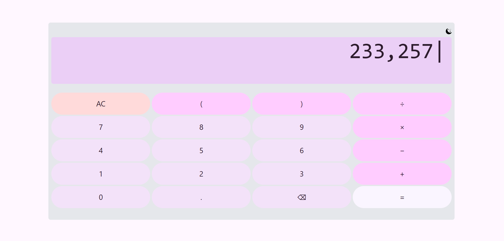

💻 Simple Calculator
This is a responsive, modern calculator web app built using HTML, CSS, and JavaScript. It is my Task 1 as part of my 1-month internship at CodeAlpha.

✅ Clean UI, keyboard support, light/dark mode, and real-time calculation using math.js.

🚀 Key Features
🌓 Dark/Light Mode Toggle
Easily switch between light and dark themes for better accessibility.

🎯 Responsive Design
Works across all devices – mobile, tablet, and desktop.

⌨️ Keyboard Input Support
Perform calculations using both mouse and keyboard.

✨ Animated Buttons
Buttons scale and animate for a tactile user experience.

🔊 Button Click Sound
A subtle sound plays on button clicks for added interactivity.

📊 Formatted Output
Comma formatting for better readability of large numbers.

⚡ Real-time Calculations with math.js
Uses math.js for reliable and advanced mathematical expression evaluation.

🛠️ Tech Stack
HTML5

CSS3 (with Tailwind-style utility classes)

JavaScript ES6+

math.js – powerful math library

Optional: custom icons and audio files for better UX

📁 Project Structure
calculator/
├── index.html         # Main HTML structure
├── style.css          # Styling (includes light/dark mode themes)
├── script.js          # Logic and interactivity
├── icons/
│   ├── sun-icon.png
│   └── night-icon.png
└── audio/
    └── click.mp3
🎯 Usage
Clone the repository or download the source files.

Open index.html in your browser.

Use either your keyboard or mouse to perform calculations.

Click the moon/sun icon to toggle between dark and light themes.

📸 Demo

📍 Internship Details
Internship Duration: 1 Month

Organization: CodeAlpha

Task: Build a fully functional, styled calculator as Task 1

🙌 Acknowledgements
Special thanks to CodeAlpha for the opportunity and guidance.

Icons and sound effects are sourced from open resources.